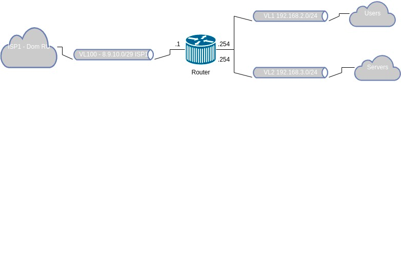

# Домашнее задание к занятию "3.8. Компьютерные сети, лекция 3"

1. Подключитесь к публичному маршрутизатору в интернет. Найдите маршрут к вашему публичному IP
```
telnet route-views.routeviews.org
Username: rviews
show ip route x.x.x.x/32
show bgp x.x.x.x/32
```

```bash
$ telnet route-views.routeviews.org
Trying 128.223.51.103...
Connected to route-views.routeviews.org.
Escape character is '^]'.
C
**********************************************************************

                    RouteViews BGP Route Viewer
                    route-views.routeviews.org

 route views data is archived on http://archive.routeviews.org

 This hardware is part of a grant by the NSF.
 Please contact help@routeviews.org if you have questions, or
 if you wish to contribute your view.

 This router has views of full routing tables from several ASes.
 The list of peers is located at http://www.routeviews.org/peers
 in route-views.oregon-ix.net.txt

 NOTE: The hardware was upgraded in August 2014.  If you are seeing
 the error message, "no default Kerberos realm", you may want to
 in Mac OS X add "default unset autologin" to your ~/.telnetrc

 To login, use the username "rviews".

 **********************************************************************


User Access Verification

Username: rviews

route-views>show ip route 37.112.222.89   
Routing entry for 37.112.208.0/20
  Known via "bgp 6447", distance 20, metric 0
  Tag 6939, type external
  Last update from 64.71.137.241 19:30:09 ago
  Routing Descriptor Blocks:
  * 64.71.137.241, from 64.71.137.241, 19:30:09 ago
      Route metric is 0, traffic share count is 1
      AS Hops 3
      Route tag 6939
      MPLS label: none
route-views>show bgp 37.112.222.89
BGP routing table entry for 37.112.208.0/20, version 2037644393
Paths: (24 available, best #1, table default)
  Not advertised to any peer
  Refresh Epoch 1
  6939 9049 34533
    64.71.137.241 from 64.71.137.241 (216.218.252.164)
      Origin IGP, localpref 100, valid, external, best
      path 7FE157C95308 RPKI State not found
      rx pathid: 0, tx pathid: 0x0
  Refresh Epoch 1
  3333 9002 9049 34533
    193.0.0.56 from 193.0.0.56 (193.0.0.56)
      Origin IGP, localpref 100, valid, external
      path 7FE08D21E830 RPKI State not found
      rx pathid: 0, tx pathid: 0
  Refresh Epoch 1
  101 174 1299 9049 9049 9049 34533
    209.124.176.223 from 209.124.176.223 (209.124.176.223)
      Origin incomplete, localpref 100, valid, external
      Community: 101:20100 101:20110 101:22100 174:21000 174:22013
      Extended Community: RT:101:22100
      path 7FE0BAA50198 RPKI State not found
      rx pathid: 0, tx pathid: 0
  Refresh Epoch 1
  8283 57866 9002 9049 34533
    94.142.247.3 from 94.142.247.3 (94.142.247.3)
      Origin IGP, metric 0, localpref 100, valid, external
      Community: 8283:15 9002:0 9002:64667
      unknown transitive attribute: flag 0xE0 type 0x20 length 0xC
        value 0000 205B 0000 0006 0000 000F 
      path 7FE1329772E8 RPKI State not found
      rx pathid: 0, tx pathid: 0
  Refresh Epoch 1
  53767 174 174 1299 9049 9049 9049 34533
    162.251.163.2 from 162.251.163.2 (162.251.162.3)
      Origin incomplete, localpref 100, valid, external
      Community: 174:21000 174:22013 53767:5000
      path 7FE09F9D56F8 RPKI State not found
      rx pathid: 0, tx pathid: 0
  Refresh Epoch 1
  3267 9049 34533
    194.85.40.15 from 194.85.40.15 (185.141.126.1)
      Origin incomplete, metric 0, localpref 100, valid, external
      path 7FE0D22A62D0 RPKI State not found
      rx pathid: 0, tx pathid: 0
  Refresh Epoch 1
  3561 3910 3356 9002 9002 9002 9002 9002 9049 34533
    206.24.210.80 from 206.24.210.80 (206.24.210.80)
      Origin IGP, localpref 100, valid, external
      path 7FE120B6B1C8 RPKI State not found
      rx pathid: 0, tx pathid: 0
  Refresh Epoch 1
  7018 1299 9049 9049 9049 34533
    12.0.1.63 from 12.0.1.63 (12.0.1.63)
      Origin incomplete, localpref 100, valid, external
      Community: 7018:5000 7018:37232
      path 7FE09D9EC3B8 RPKI State not found
      rx pathid: 0, tx pathid: 0
  Refresh Epoch 1
  3356 9002 9002 9002 9002 9002 9049 34533
    4.68.4.46 from 4.68.4.46 (4.69.184.201)
      Origin IGP, metric 0, localpref 100, valid, external
      Community: 3356:2 3356:22 3356:100 3356:123 3356:503 3356:903 3356:2067
      path 7FE14FE5AB28 RPKI State not found
      rx pathid: 0, tx pathid: 0
  Refresh Epoch 1
  3549 3356 9002 9002 9002 9002 9002 9049 34533
    208.51.134.254 from 208.51.134.254 (67.16.168.191)
      Origin IGP, metric 0, localpref 100, valid, external
      Community: 3356:2 3356:22 3356:100 3356:123 3356:503 3356:903 3356:2067 3549:2581 3549:30840
      path 7FE0BD98FA80 RPKI State not found
      rx pathid: 0, tx pathid: 0
  Refresh Epoch 1
  701 1299 9049 9049 9049 34533
    137.39.3.55 from 137.39.3.55 (137.39.3.55)
      Origin incomplete, localpref 100, valid, external
      path 7FE13771B4B0 RPKI State not found
      rx pathid: 0, tx pathid: 0
  Refresh Epoch 1
  19214 174 1299 9049 9049 9049 34533
    208.74.64.40 from 208.74.64.40 (208.74.64.40)
      Origin incomplete, localpref 100, valid, external
      Community: 174:21000 174:22013
      path 7FE16A62ECE8 RPKI State not found
      rx pathid: 0, tx pathid: 0
  Refresh Epoch 1
  20130 6939 9049 34533
    140.192.8.16 from 140.192.8.16 (140.192.8.16)
      Origin IGP, localpref 100, valid, external
      path 7FE14ADAB390 RPKI State not found
      rx pathid: 0, tx pathid: 0
  Refresh Epoch 1
  20912 3257 9002 9049 34533
    212.66.96.126 from 212.66.96.126 (212.66.96.126)
      Origin IGP, localpref 100, valid, external
      Community: 3257:8052 3257:50001 3257:54900 3257:54901 20912:65004 65535:65284
      path 7FE156E09578 RPKI State not found
      rx pathid: 0, tx pathid: 0
  Refresh Epoch 1
  4901 6079 9002 9002 9002 9002 9002 9049 34533
    162.250.137.254 from 162.250.137.254 (162.250.137.254)
      Origin IGP, localpref 100, valid, external
      Community: 65000:10100 65000:10300 65000:10400
      path 7FE146D6BFD8 RPKI State not found
      rx pathid: 0, tx pathid: 0
  Refresh Epoch 1
  1351 6939 9049 34533
    132.198.255.253 from 132.198.255.253 (132.198.255.253)
      Origin IGP, localpref 100, valid, external
      path 7FE1112E40C8 RPKI State not found
      rx pathid: 0, tx pathid: 0
  Refresh Epoch 1
  57866 9002 9049 34533
    37.139.139.17 from 37.139.139.17 (37.139.139.17)
      Origin IGP, metric 0, localpref 100, valid, external
      Community: 9002:0 9002:64667
      path 7FE0D0F37408 RPKI State not found
      rx pathid: 0, tx pathid: 0
  Refresh Epoch 1
  852 3257 9002 9049 34533
    154.11.12.212 from 154.11.12.212 (96.1.209.43)
      Origin IGP, metric 0, localpref 100, valid, external
      path 7FE16CD28DA8 RPKI State not found
      rx pathid: 0, tx pathid: 0
  Refresh Epoch 1
  3303 6939 9049 34533
    217.192.89.50 from 217.192.89.50 (138.187.128.158)
      Origin IGP, localpref 100, valid, external
      Community: 3303:1006 3303:1021 3303:1030 3303:3067 6939:7337 6939:8752 6939:9002
      path 7FE128E85798 RPKI State not found
      rx pathid: 0, tx pathid: 0
  Refresh Epoch 1
  7660 2516 1299 9049 9049 9049 34533
    203.181.248.168 from 203.181.248.168 (203.181.248.168)
      Origin incomplete, localpref 100, valid, external
      Community: 2516:1030 7660:9003
      path 7FE0D09006E0 RPKI State not found
      rx pathid: 0, tx pathid: 0
  Refresh Epoch 2
  2497 1299 9049 9049 9049 34533
    202.232.0.2 from 202.232.0.2 (58.138.96.254)
      Origin incomplete, localpref 100, valid, external
      path 7FE13F897648 RPKI State not found
      rx pathid: 0, tx pathid: 0
  Refresh Epoch 1
  49788 12552 9002 9049 34533
    91.218.184.60 from 91.218.184.60 (91.218.184.60)
      Origin IGP, localpref 100, valid, external
      Community: 12552:10000 12552:14000 12552:14100 12552:14101 12552:24000
      Extended Community: 0x43:100:1
      path 7FE18AD17788 RPKI State not found
      rx pathid: 0, tx pathid: 0
  Refresh Epoch 1
  1221 4637 9002 9049 34533
    203.62.252.83 from 203.62.252.83 (203.62.252.83)
      Origin IGP, localpref 100, valid, external
      path 7FE12810AD18 RPKI State not found
      rx pathid: 0, tx pathid: 0
  Refresh Epoch 1
  3257 9002 9049 34533
    89.149.178.10 from 89.149.178.10 (213.200.83.26)
      Origin IGP, metric 10, localpref 100, valid, external
      Community: 3257:8052 3257:50001 3257:54900 3257:54901 65535:65284
      path 7FE12C5A2998 RPKI State not found
      rx pathid: 0, tx pathid: 0
```
2. Создайте dummy0 интерфейс в Ubuntu. Добавьте несколько статических маршрутов. Проверьте таблицу маршрутизации.


3. Проверьте открытые TCP порты в Ubuntu, какие протоколы и приложения используют эти порты? Приведите несколько примеров.

```bash
$ ss -lt
State            Recv-Q           Send-Q                            Local Address:Port                             Peer Address:Port           Process           
LISTEN           0                4096                              127.0.0.53%lo:domain                                0.0.0.0:*                                
LISTEN           0                5                                     127.0.0.1:ipp                                   0.0.0.0:*                                
LISTEN           0                244                                   127.0.0.1:postgresql                            0.0.0.0:*                                
LISTEN           0                244                                   127.0.0.1:5433                                  0.0.0.0:*                                
LISTEN           0                5                                     127.0.0.1:29754                                 0.0.0.0:*                                
LISTEN           0                4096                         [::ffff:127.0.0.1]:63342                                       *:*                                
LISTEN           0                511                                           *:http                                        *:*                                
LISTEN           0                5                                         [::1]:ipp                                      [::]:*                                
LISTEN           0                4096                         [::ffff:127.0.0.1]:6942                                        *:*  
```
22 - ssh
80 - http
5432 - postgresql

5. Проверьте используемые UDP сокеты в Ubuntu, какие протоколы и приложения используют эти порты?
```bash
$ ss -lu
State   Recv-Q  Send-Q                             Local Address:Port                              Peer Address:Port                  Process                   
UNCONN  0       0                                  192.168.0.104:40567                                  0.0.0.0:*                                               
UNCONN  0       0                                  127.0.0.53%lo:domain                                 0.0.0.0:*                                               
UNCONN  0       0                                        0.0.0.0:631                                    0.0.0.0:*                                               
UNCONN  0       0                                        0.0.0.0:51323                                  0.0.0.0:*                                               
UNCONN  0       0                                    224.0.0.251:mdns                                   0.0.0.0:*                                               
UNCONN  0       0                                    224.0.0.251:mdns                                   0.0.0.0:*                                               
UNCONN  0       0                                        0.0.0.0:mdns                                   0.0.0.0:*                                               
UNCONN  0       0                                           [::]:40443                                     [::]:*                                               
UNCONN  0       0          [fe80::7324:afe1:b3d3:efdd]%wlp0s20f3:dhcpv6-client                             [::]:*                                               
UNCONN  0       0                                              *:42241                                        *:*                                               
UNCONN  0       0                                              *:45542                                        *:*                                               
UNCONN  0       0                                           [::]:mdns                                      [::]:*                                               
 
```
631 - Common Unix Printing System (CUPS) (Unofficial) и  Internet Printing Protocol (IPP) (Official)

7. Используя diagrams.net, создайте L3 диаграмму вашей домашней сети или любой другой сети, с которой вы работали. 




