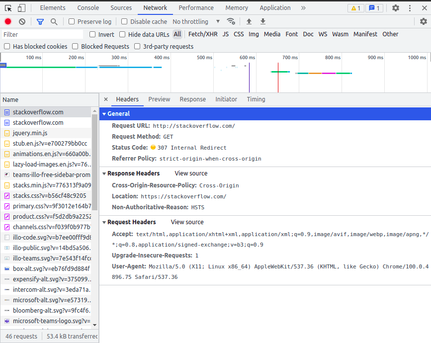
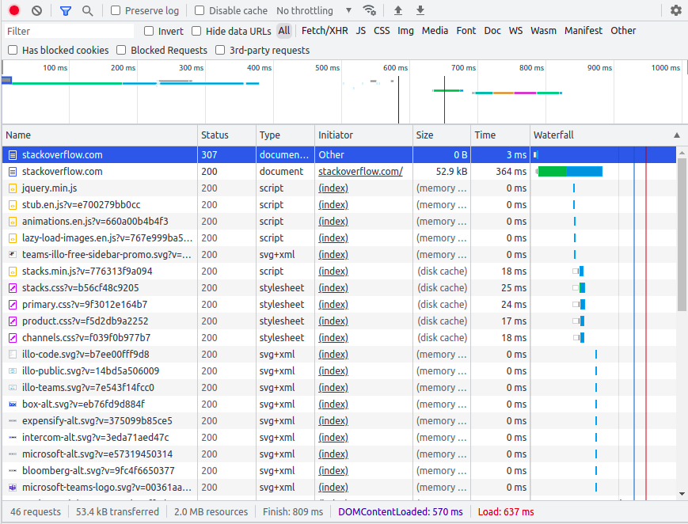
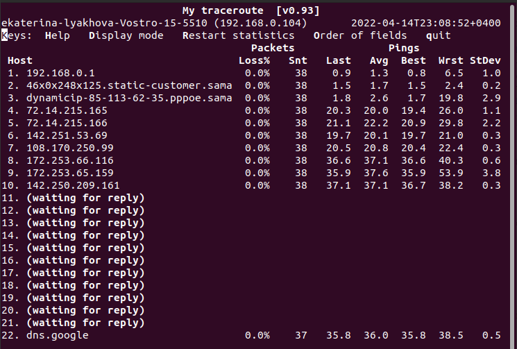

# Домашнее задание к занятию "3.6. Компьютерные сети, лекция 1"

1. Работа c HTTP через телнет.
- Подключитесь утилитой телнет к сайту stackoverflow.com
`telnet stackoverflow.com 80`
- отправьте HTTP запрос
```bash
GET /questions HTTP/1.0
HOST: stackoverflow.com
[press enter]
[press enter]
```
- В ответе укажите полученный HTTP код, что он означает?

A:
```bash
$ telnet stackoverflow.com 80
Trying 151.101.1.69...
Connected to stackoverflow.com.
Escape character is '^]'.
GET /questions HTTP/1.0
HOST: stackoverflow.com

HTTP/1.1 301 Moved Permanently
cache-control: no-cache, no-store, must-revalidate
location: https://stackoverflow.com/questions
x-request-guid: 76629f2f-63a9-48cb-8c1c-fc135900814b
feature-policy: microphone 'none'; speaker 'none'
content-security-policy: upgrade-insecure-requests; frame-ancestors 'self' https://stackexchange.com
Accept-Ranges: bytes
Date: Thu, 14 Apr 2022 18:26:27 GMT
Via: 1.1 varnish
Connection: close
X-Served-By: cache-hel1410020-HEL
X-Cache: MISS
X-Cache-Hits: 0
X-Timer: S1649960787.491621,VS0,VE110
Vary: Fastly-SSL
X-DNS-Prefetch-Control: off
Set-Cookie: prov=53f9066a-0283-ed7c-24cf-566d92a462f0; domain=.stackoverflow.com; expires=Fri, 01-Jan-2055 00:00:00 GMT; path=/; HttpOnly

Connection closed by foreign host.
```
Получена ошибка 301 - страница перемещена. 

2. Повторите задание 1 в браузере, используя консоль разработчика F12.
- откройте вкладку `Network`
- отправьте запрос http://stackoverflow.com
- найдите первый ответ HTTP сервера, откройте вкладку `Headers`
- укажите в ответе полученный HTTP код.
- проверьте время загрузки страницы, какой запрос обрабатывался дольше всего?
- приложите скриншот консоли браузера в ответ.

A: Первый ответ HTTP сервера - 307 internal redirect
Время загрузки страницы 637 мс
Дольше всего обрабатывался get запрос к https://stackoverfrow.com - 364 мс





3. Какой IP адрес у вас в интернете?
A: IP выдуманный
```bash
$curl ifconfig.me
12.345.678.90
```
4. Какому провайдеру принадлежит ваш IP адрес? Какой автономной системе AS? Воспользуйтесь утилитой `whois`

A: 
```bash
$ whois -h whois.radb.net 12.345.678.90
route:          12.345.678.90/20
origin:         AS12345
...
```

5. Через какие сети проходит пакет, отправленный с вашего компьютера на адрес 8.8.8.8? Через какие AS? Воспользуйтесь утилитой `traceroute`

A: Не удалось повторить пример из лекции с опциями -An. т.к. моя версия traceroute их не поддерживает  
```bash
$ traceroute 8.8.8.8
traceroute to 8.8.8.8 (8.8.8.8), 64 hops max
  1   192.168.0.1  2,534ms  0,672ms  1,126ms 
  2   *  *  * 
  3   85.113.62.35  7,498ms  2,298ms  2,880ms 
  4   72.14.215.165  20,150ms  20,215ms  20,671ms 
  5   72.14.215.166  19,934ms  18,573ms  18,427ms 
  6   *  *  * 
  7   108.170.250.33  20,992ms  19,121ms  19,488ms 
  8   108.170.250.113  17,510ms  18,324ms  17,539ms 
  9   142.251.237.156  30,681ms  30,233ms  30,395ms 
 10   142.251.238.66  47,038ms  38,572ms  33,169ms 
 11   142.250.56.219  35,019ms  34,542ms  34,657ms 
 12   *  *  * 
 13   *  *  * 
 14   *  *  * 
 15   *  *  * 
 16   *  *  * 
 17   *  *  * 
 18   *  *  * 
 19   *  *  * 
 20   *  *  * 
 21   *  *  * 
 22   *  *  * 
 23   8.8.8.8  34,059ms  31,886ms  31,865ms 

```

6. Повторите задание 5 в утилите `mtr`. На каком участке наибольшая задержка - delay?

A: Наибольшая задержка на 9 участке
```bash
mtr 8.8.8.8
```


7. Какие DNS сервера отвечают за доменное имя dns.google? Какие A записи? воспользуйтесь утилитой `dig`

A: A записи 8.8.8.8 и 8.8.4.4
```bash
$ dig +trace @8.8.8.8 dns.google

; <<>> DiG 9.16.1-Ubuntu <<>> +trace @8.8.8.8 dns.google
; (1 server found)
;; global options: +cmd
.			80980	IN	NS	a.root-servers.net.
.			80980	IN	NS	b.root-servers.net.
.			80980	IN	NS	c.root-servers.net.
.			80980	IN	NS	d.root-servers.net.
.			80980	IN	NS	e.root-servers.net.
.			80980	IN	NS	f.root-servers.net.
.			80980	IN	NS	g.root-servers.net.
.			80980	IN	NS	h.root-servers.net.
.			80980	IN	NS	i.root-servers.net.
.			80980	IN	NS	j.root-servers.net.
.			80980	IN	NS	k.root-servers.net.
.			80980	IN	NS	l.root-servers.net.
.			80980	IN	NS	m.root-servers.net.
.			80980	IN	RRSIG	NS 8 0 518400 20220427170000 20220414160000 47671 . S9otQ/cLZS7+3y0K7IpVuS2tHs/yKaFw/3cJMwZYMJ72YX5nR9DLKRTU oYiS2betAM+9T4GssqGY2U9/KUU10Ju2HvOBmhLqWUU2vQxiKX6zjzfE MjWMgZTK24CZvSSyqkvs1JZn0/uroU8HY7wAE380sWTwCaXeINWUUEX0 PkO/K73TUjTpidorAjm16bpLDJl3jwZB84QukD72LrvqI4my0D+0T2wI BtFXvC6e3SQM6/VtE6582eA0IhRzRRddIrCO6P7K1ZuCI06pKhArPcJt 3N7J9zG7/jv2YWH/gXz2R3O1QrRdZLR0bq2dnb2oDDJbEX/Vbtp0JjWo 1Y5FZQ==
;; Received 525 bytes from 8.8.8.8#53(8.8.8.8) in 40 ms

google.			172800	IN	NS	ns-tld1.charlestonroadregistry.com.
google.			172800	IN	NS	ns-tld2.charlestonroadregistry.com.
google.			172800	IN	NS	ns-tld3.charlestonroadregistry.com.
google.			172800	IN	NS	ns-tld4.charlestonroadregistry.com.
google.			172800	IN	NS	ns-tld5.charlestonroadregistry.com.
google.			86400	IN	DS	6125 8 2 80F8B78D23107153578BAD3800E9543500474E5C30C29698B40A3DB2 3ED9DA9F
google.			86400	IN	RRSIG	DS 8 1 86400 20220427170000 20220414160000 47671 . ad28FHm0bnQwXyTECZnGsi4+ut7Hy0kNhCTUtdxMLuvH7yA6MMALrC+Q vIQDHPsqVKH08SOMMSLDvdrwz210bocz2WoQNg/XlT8FXTptWno2tXhj ww+MQdsvd3p7OiTid0hcSXfzVLuh2YVXcgWI6sIRXIGWgRi6+0fIb45n WnXv8Ly1JqOmwyIo1OPTHrIC6r4+T//n2TgxDeGmVr8VTRgQghR9R6nf HERyrmu3umceIcYEscTMviSF5E14UaAoxpkogBb45TGO2nNFQpie3hPA 5Vu66ZmqDaNy9wl36YybbwvF6SPvuO7slDKZvnw0tu0ouhWpOBf6ncg2 CCYGQA==
;; Received 730 bytes from 192.58.128.30#53(j.root-servers.net) in 16 ms

dns.google.		10800	IN	NS	ns4.zdns.google.
dns.google.		10800	IN	NS	ns1.zdns.google.
dns.google.		10800	IN	NS	ns2.zdns.google.
dns.google.		10800	IN	NS	ns3.zdns.google.
dns.google.		3600	IN	DS	56044 8 2 1B0A7E90AA6B1AC65AA5B573EFC44ABF6CB2559444251B997103D2E4 0C351B08
dns.google.		3600	IN	RRSIG	DS 8 2 3600 20220504090809 20220412090809 3730 google. bKDS1Waq3FJ8K9xgHUUbypR2zxtZJN/K/O1ASCns95Jni2Q8YybkS34q EjhtxStdjdnAnhsX3pZIHprzAnFLzEhkDrXKH7g7ihxDLGHDH30ajXUH +VBk0gXtaAL6znbQ0NY6zH1N7F51bH5R8o9XbnWqbNwNsbNRFke9d2Zb j6c=
;; Received 506 bytes from 216.239.34.105#53(ns-tld2.charlestonroadregistry.com) in 56 ms

dns.google.		900	IN	A	8.8.4.4
dns.google.		900	IN	A	8.8.8.8
dns.google.		900	IN	RRSIG	A 8 2 900 20220503080327 20220411080327 9426 dns.google. RuuVUyMUfayaovylH9ZxMX6qdi2dndEOT3UTdU057JAzdX7h7kOMbqzi 5VPhCHBkFw6yyIJxjPbv6t3a8eop9jVbjXt/xr+QXu9qmkOqWdE4822V w+1svGYhHifNXIN3h/APQx1nX7ov2N3pJ5bnv9x10CaffHtURzEvdKal tkA=
;; Received 241 bytes from 216.239.36.114#53(ns3.zdns.google) in 32 ms
```

8. Проверьте PTR записи для IP адресов из задания 7. Какое доменное имя привязано к IP? воспользуйтесь утилитой `dig`

A: Доменное имя dns.google
```bash
$ dig -x 8.8.8.8

; <<>> DiG 9.16.1-Ubuntu <<>> -x 8.8.8.8
;; global options: +cmd
;; Got answer:
;; ->>HEADER<<- opcode: QUERY, status: NOERROR, id: 49019
;; flags: qr rd ra; QUERY: 1, ANSWER: 1, AUTHORITY: 0, ADDITIONAL: 1

;; OPT PSEUDOSECTION:
; EDNS: version: 0, flags:; udp: 65494
;; QUESTION SECTION:
;8.8.8.8.in-addr.arpa.		IN	PTR

;; ANSWER SECTION:
8.8.8.8.in-addr.arpa.	61634	IN	PTR	dns.google.

;; Query time: 0 msec
;; SERVER: 127.0.0.53#53(127.0.0.53)
;; WHEN: Чт апр 14 23:27:07 +04 2022
;; MSG SIZE  rcvd: 73

$ dig -x 8.8.4.4

; <<>> DiG 9.16.1-Ubuntu <<>> -x 8.8.4.4
;; global options: +cmd
;; Got answer:
;; ->>HEADER<<- opcode: QUERY, status: NOERROR, id: 12306
;; flags: qr rd ra; QUERY: 1, ANSWER: 1, AUTHORITY: 0, ADDITIONAL: 1

;; OPT PSEUDOSECTION:
; EDNS: version: 0, flags:; udp: 65494
;; QUESTION SECTION:
;4.4.8.8.in-addr.arpa.		IN	PTR

;; ANSWER SECTION:
4.4.8.8.in-addr.arpa.	62889	IN	PTR	dns.google.

;; Query time: 3 msec
;; SERVER: 127.0.0.53#53(127.0.0.53)
;; WHEN: Чт апр 14 23:27:23 +04 2022
;; MSG SIZE  rcvd: 73

```


