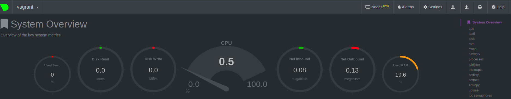

# Домашнее задание к занятию "3.4. Операционные системы, лекция 2"

1. На лекции мы познакомились с [node_exporter](https://github.com/prometheus/node_exporter/releases). В демонстрации его исполняемый файл запускался в background. Этого достаточно для демо, но не для настоящей production-системы, где процессы должны находиться под внешним управлением. Используя знания из лекции по systemd, создайте самостоятельно простой [unit-файл](https://www.freedesktop.org/software/systemd/man/systemd.service.html) для node_exporter:

    * поместите его в автозагрузку,
    * предусмотрите возможность добавления опций к запускаемому процессу через внешний файл (посмотрите, например, на systemctl cat cron),
    * удостоверьтесь, что с помощью systemctl процесс корректно стартует, завершается, а после перезагрузки автоматически поднимается.

------------

**Доработка по заданию 1**

**Q:** Предлагаю уточнить как именно в службу будут передаваться дополнительные опции. Примеры можно посмотреть вот здесь:
www.freedesktop.org...ExecStart=
unix.stackexchange.com...unit-files
stackoverflow.com...-unit-file
Замечу, что речь идёт не о переменных окружения, а об опциях (параметрах) запуска службы.

**A:** Изменила конфигурационный файл node_exporter и добавила EnvironmentFile
```bash
vagrant@vagrant:~$ cat /etc/sysconfig/node_exporter
OPTIONS="--collector.cpu.info"
vagrant@vagrant:~$ cat /etc/systemd/system/node_exporter.service 
[Unit]
Description=Node Exporter
After=network.target

[Service]
User=node_exporter
Group=node_exporter
Type=simple
EnvironmentFile=/etc/sysconfig/node_exporter
ExecStart=/usr/local/bin/node_exporter $OPTIONS

[Install]
WantedBy=multi-user.target
```

Здесь ключ `--collector.cpu.info` включает метрику `cpu_info`

-----------------

Конфигурационный файл:
```bash
vagrant@vagrant:/tmp$ systemctl cat node_exporter.service
# /etc/systemd/system/node_exporter.service
[Unit]
Description=Node Exporter
After=network.target

[Service]
User=node_exporter
Group=node_exporter
Type=simple
ExecStart=/usr/local/bin/node_exporter

[Install]
WantedBy=multi-user.target
```

Добавила node_exporter в автозапуск
```bash
sudo systemctl enable node_exporter
```
Далее демонстрация успешной работы. Вызов `curl -s http://localhost:9100/metrics` показан частично. 
После перезапуска node_exporter стартует автоматически.
```bash
vagrant@vagrant:/tmp$ node_exporter --version
node_exporter, version 1.3.1 (branch: HEAD, revision: a2321e7b940ddcff26873612bccdf7cd4c42b6b6)
  build user:       root@243aafa5525c
  build date:       20211205-11:09:49
  go version:       go1.17.3
  platform:         linux/amd64
vagrant@vagrant:/tmp$ systemctl stop node_exporter
==== AUTHENTICATING FOR org.freedesktop.systemd1.manage-units ===
Authentication is required to stop 'node_exporter.service'.
Authenticating as: vagrant
Password: 
==== AUTHENTICATION COMPLETE ===
vagrant@vagrant:/tmp$ ps aux | grep node_exporter
root        1517  0.0  0.4  11020  4692 pts/0    T    18:43   0:00 sudo systemctl status node_exporter
root        1518  0.0  0.4  11028  4092 pts/0    T    18:43   0:00 systemctl status node_exporter
vagrant     1652  0.0  0.0   8164   740 pts/0    S+   19:11   0:00 grep --color=auto node_exporter
vagrant@vagrant:/tmp$ systemctl start node_exporter
==== AUTHENTICATING FOR org.freedesktop.systemd1.manage-units ===
Authentication is required to start 'node_exporter.service'.
Authenticating as: vagrant
Password: 
==== AUTHENTICATION COMPLETE ===
vagrant@vagrant:/tmp$ ps aux | grep node_exporter
root        1517  0.0  0.4  11020  4692 pts/0    T    18:43   0:00 sudo systemctl status node_exporter
root        1518  0.0  0.4  11028  4092 pts/0    T    18:43   0:00 systemctl status node_exporter
node_ex+    1662  0.2  1.1 715964 11348 ?        Ssl  19:12   0:00 /usr/local/bin/node_exporter
vagrant     1677  0.0  0.0   8164   664 pts/0    S+   19:12   0:00 grep --color=auto node_exporter
vagrant@vagrant:/tmp$ curl -s http://localhost:9100/metrics
# HELP go_gc_duration_seconds A summary of the pause duration of garbage collection cycles.
# TYPE go_gc_duration_seconds summary
go_gc_duration_seconds{quantile="0"} 0
go_gc_duration_seconds{quantile="0.25"} 0
go_gc_duration_seconds{quantile="0.5"} 0
go_gc_duration_seconds{quantile="0.75"} 0
go_gc_duration_seconds{quantile="1"} 0
go_gc_duration_seconds_sum 0
go_gc_duration_seconds_count 0
# HELP go_goroutines Number of goroutines that currently exist.
# TYPE go_goroutines gauge
go_goroutines 8
# HELP go_info Information about the Go environment.
# TYPE go_info gauge
go_info{version="go1.17.3"} 1

```

2. Ознакомьтесь с опциями node_exporter и выводом `/metrics` по-умолчанию. Приведите несколько опций, 
которые вы бы выбрали для базового мониторинга хоста по CPU, памяти, диску и сети.

```commandline
cpu:
node_cpu_seconds_total{mode!="idle"} - показывает время когда когда система была нагружена

disk:
node_disk_io_time_seconds_total{device="sda"}
node_disk_read_time_seconds_total{device="sda"}
node_disk_write_time_seconds_total{device="sda"}

memory:
node_memory_MemTotal_bytes
node_memory_MemFree_bytes - not including caches and buffers
node_memory_MemAvailable_bytes - including caches and buffers
node_memory_Buffers_bytes
node_memory_Cached_bytes

network:
node_network_receive_bytes_total 
node_network_transmit_bytes_total
```


3. Установите в свою виртуальную машину [Netdata](https://github.com/netdata/netdata). Воспользуйтесь [готовыми пакетами](https://packagecloud.io/netdata/netdata/install) для установки (`sudo apt install -y netdata`). После успешной установки:
    * в конфигурационном файле `/etc/netdata/netdata.conf` в секции [web] замените значение с localhost на `bind to = 0.0.0.0`,
    * добавьте в Vagrantfile проброс порта Netdata на свой локальный компьютер и сделайте `vagrant reload`:

    ```bash
    config.vm.network "forwarded_port", guest: 19999, host: 19999
    ```

    После успешной перезагрузки в браузере *на своем ПК* (не в виртуальной машине) вы должны суметь зайти на `localhost:19999`. Ознакомьтесь с метриками, которые по умолчанию собираются Netdata и с комментариями, которые даны к этим метрикам.

Готово


4. Можно ли по выводу `dmesg` понять, осознает ли ОС, что загружена не на настоящем оборудовании, а на системе виртуализации?
Да, можно. Например, такой вывод мы получим на настоящем оборудовании:

```bash
$ sudo dmesg | grep virtualiz
[    0.035835] Booting paravirtualized kernel on bare hardware
```

В то время на виртуальной машине результат будет пустым.

5. Как настроен sysctl `fs.nr_open` на системе по-умолчанию? Узнайте, что означает этот параметр. Какой другой существующий лимит не позволит достичь такого числа (`ulimit --help`)?

По умолчанию `fs.nr_open`:
```bash
vagrant@vagrant:~$ cat /proc/sys/fs/nr_open
1048576
``` 

Описание этого параметра:
```bash
This denotes the maximum number of file-handles a process can 
allocate. Default value is 1024*1024 (1048576) which should be 
enough for most machines. Actual limit depends on RLIMIT_NOFILE 
resource limit.
```

С помощью `ulimit` можно задать мягкие и жесткие ограничения:
   * Мягкий лимит `ulimit -Sn` может быть увеличен процессом во время работы
   * Жесткий лимит `ulimit -Hn` может быть только уменьшен
Оба лимита не могут превышать системный лимит `fs.nr_open`

7. Запустите любой долгоживущий процесс (не `ls`, который отработает мгновенно, а, например, `sleep 1h`) в отдельном неймспейсе процессов; покажите, что ваш процесс работает под PID 1 через `nsenter`. Для простоты работайте в данном задании под root (`sudo -i`). Под обычным пользователем требуются дополнительные опции (`--map-root-user`) и т.д.

```bash
root@vagrant:/home/vagrant# sudo unshare --fork --pid --mount-proc /bin/bash
root@vagrant:/home/vagrant# ps
    PID TTY          TIME CMD
      1 pts/0    00:00:00 bash
      8 pts/0    00:00:00 ps
root@vagrant:/home/vagrant# sleep 1h

vagrant@vagrant:~$ sudo -i
root@vagrant:~# ps aux |grep sleep
root        1532  0.0  0.0   7228   592 pts/0    S+   18:19   0:00 sleep 1h
root        1596  0.0  0.0   8160   732 pts/1    S+   18:19   0:00 grep --color=auto sleep
root@vagrant:~# sudo nsenter --target 1532 --pid --mount
root@vagrant:/# ps aux
USER         PID %CPU %MEM    VSZ   RSS TTY      STAT START   TIME COMMAND
root           1  0.0  0.3   8960  3904 pts/0    S    18:17   0:00 /bin/bash
root           9  0.0  0.0   7228   592 pts/0    S+   18:19   0:00 sleep 1h
root          10  0.2  0.4   8960  4080 pts/1    S    18:20   0:00 -bash
root          21  0.0  0.3  10616  3352 pts/1    R+   18:20   0:00 ps aux

``` 

Как я поняла перед выполнением действий в задании нужно сделать `sudo unshare --fork --pid --mount-proc /bin/bash` , т.к. программа ps для получения информации о текущих процессах в системе использует виртуальную файловую систему procfs. Эта файловая система монтируется в каталог /proc.  
Эта команда же создает новое пространство имен mount и монтирует в него новую procfs

8. Найдите информацию о том, что такое `:(){ :|:& };:`. Запустите эту команду в своей виртуальной машине Vagrant с Ubuntu 20.04 (**это важно, поведение в других ОС не проверялось**). Некоторое время все будет "плохо", после чего (минуты) – ОС должна стабилизироваться. Вызов `dmesg` расскажет, какой механизм помог автоматической стабилизации. Как настроен этот механизм по-умолчанию, и как изменить число процессов, которое можно создать в сессии?

`:(){ :|:& };:` - это так называемая fork bomb. По сути это рекурсивная функция, которая вызывает сама себя дважды. Т.о. порождая 2 фоновых процесса внутри себя.  
Бомбу можно разминировать: `while :; do killall -9 :; done`. 
Чтобы изменить число процессов, которые можно создать в сессии используется `ulimit -u number`. Не следует указывать слишком маленькое число чтобы система нормально функционировала.  
Автоматически стабилизироваться помогает 
```bash
vagrant@vagrant:~$ dmesg -T | grep fork
[Tue Apr  5 18:49:44 2022] cgroup: fork rejected by pids controller in /user.slice/user-1000.slice/session-3.scope
```
 


